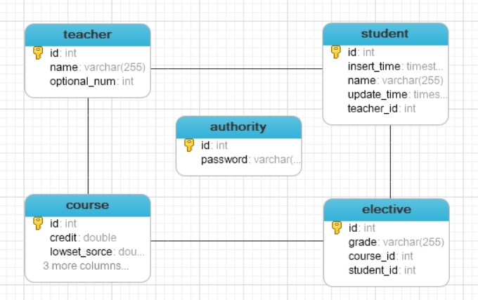
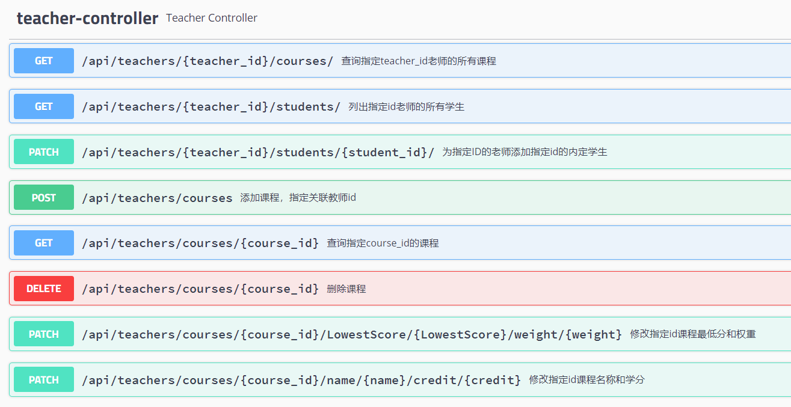

# 导师选择系统

## 关于工程
- JDK 1.11、Maven 3.2、Mysql8.0
- 使用Spring Boot作为核心框架
- 包含REST API

系统支持多个导师及学生的双向选择，导师可以设置每一门课程的权重以及最低分限制以达到对学生进行选择的目的。
学生可以对心仪导师进行选择。

### 实体类设计

### 接口
#### course-controller

###计算方式
加权平均成绩的计算，每个课程的权重乘以成绩求值，后进行排序得到最终学生名单  
$$xavg=\frac{ x1\cdot w1+x2\cdot w2+x3\cdot w3+...+xn\cdot wn}{w1+w2+w3+...+wn}$$
---

### 疑惑与发现
1. `hibernate DDL Cascade`  

    在写删除课程时，发现存在外键无法直接删除，要记得在ddl时，加上cascade操作。
    详见`eumm CascadeType`,
    以及hibernate注解ddl操作好文：https://www.cnblogs.com/javaxiaoxin/p/8279641.html
2.  `EntityManager fresh`

    关于undo区 

### 时间轴
`~2020/03/11`:  
- 创建项目 和 实体类，并进行测试。

`~2020/03/12`:  
- 新增教师实体类、  
- 新增`Authority类`进行独立账户验证   
- 创建教师与学生间多对一关系  
- 为课程类添加权重属性

`~2020/03/17`  
- 调整实体类，修改属性细节。~~新增`schedule类`作为教师和课程中间类，用于设置权重及最低分。
(用于支持多个老师对于课程的权重，进行不同的设置)~~  
- 新增抽象repositories、services。

`~2020/03/24`
- 添加 swagger

`~2020/03/25`
- 添加自定义异常 用于处理插入时的外键查找不存在，将service层异常抛至controller层处理。
- CourseController <KBD>ADD</KBD> <KBD>DELETE</KBD> <KBD>PATCH</KBD> <KBD>GET</KBD> <KBD>POST</KBD> 
- 添加老师的内定学生

`~2020/03/31`
- 优化Sevice结构，重构为student与teacher服务。

感谢阅读这份文档。
